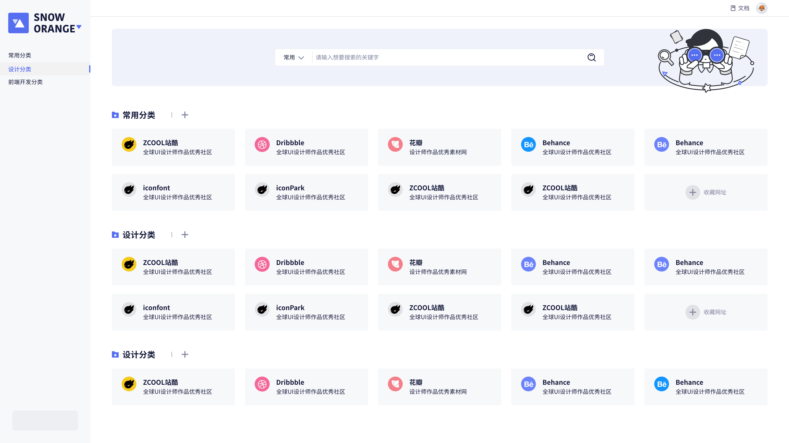
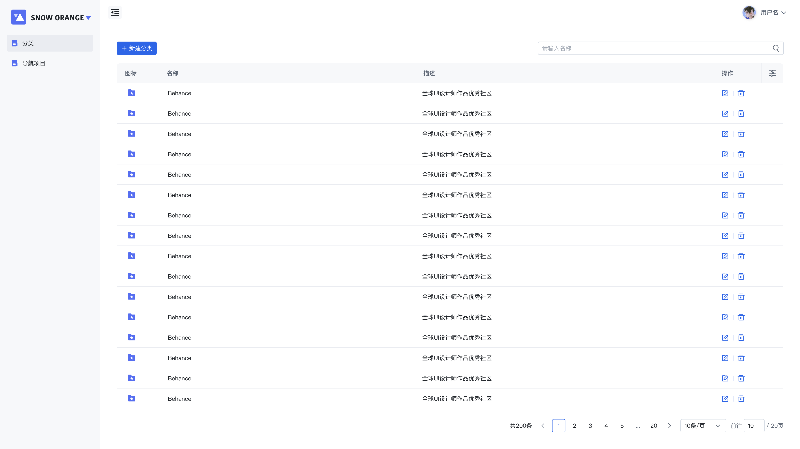
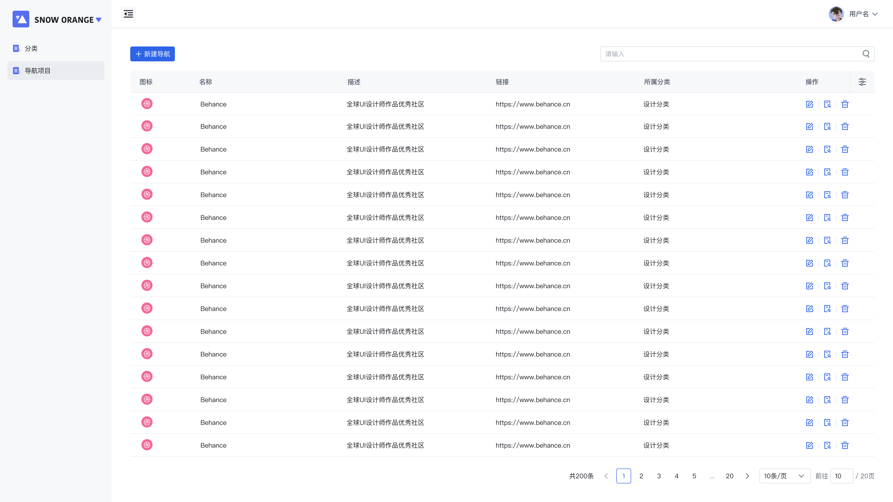
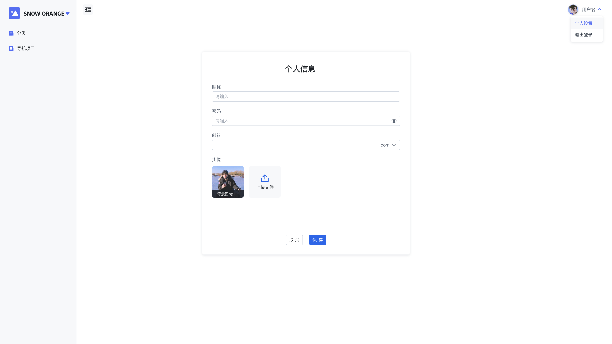

# StartPage
**StartPage** is a start page for your browser.




## Features


### Categories

Create and manage different categories to organize your websites efficiently.




### Sites
Add, edit, and remove your favorite websites within each category.



### User Management
Manage user's accounts.



## Getting Started

This is this the backend service of the project. You can find the frontend [here](https://github.com/huangcheng/startpage-web).

### Installation
1. Clone the repository:
```bash
git clone https://github.com/huangcheng/startpage-server 
```
2. Make sure you have the `sqlx-cli` installed with the `mysql` feature enabled:
```bash
cargo install sqlx-cli --no-default-features --features native-tls,mysql
```

3. Run the database migrations:
```bash
export DATABASE_URL=mysql://<username>:<password>@<host>:<port>/<database>
sqlx migrate run
```
or 
```bash
sql migrate run --database-url mysql://<username>:<password>@<host>:<port>/<database>
```

4. Configure the server by copying the `Rocekt.toml.exmaple` file to `Rocket.toml` and editing it to your needs.

5. Run the server:
```bash
cargo run
```

## License
The designer of the project is [huqinxue](https://github.com/huqinxue)
